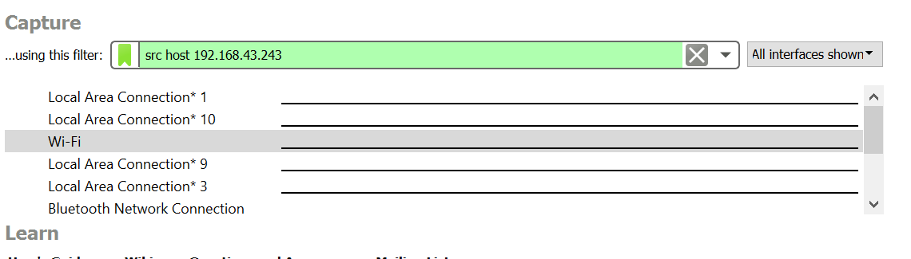

# Jarkom Modul1 Lapres B11

## Soal
Terdapat tiga buah file *.pcapng yang mendukung soal-soal display filter, yaitu:
- File pertama untuk menjawab soal nomor 1-5 dan nomor 10.
- File kedua untuk menjawab soal nomor 6, 7, dan 9.
- File ketiga untuk menjawab soal nomor 8.

#### A. Display Filter
1. Sebutkan webserver yang digunakan pada "testing.mekanis.me"!
2. Simpan gambar "Tim_Kunjungan_Kerja_BAKN_DPR_RI_ke_Sukabumi141436.jpg"!
3. Cari username dan password ketika login di "ppid.dpr.go.id"!
4. Temukan paket dari web-web yang menggunakan basic authentication method!
5. Ikuti perintah di aku.pengen.pw! Username dan password bisa didapatkan dari file .pcapng!
6. Seseorang menyimpan file zip melalui FTP dengan nama "Answer.zip". Simpan dan Buka file "Open This.pdf" di Answer.zip. Untuk mendapatkan password zipnya, temukan dalam file zipkey.txt (passwordnya adalah isi dari file txt tersebut).
7. Ada 500 file zip yang disimpan ke FTP Server dengan nama 1.zip, 2.zip, ..., 500.zip. Salah satunya berisi pdf yang berisi puisi. Simpan dan Buka file pdf tersebut. Your Super Mega Ultra Rare Hint = nama pdf-nya "Yes.pdf"
8. Cari objek apa saja yang didownload (RETR) dari koneksi FTP dengan Microsoft FTP Service!
9. Cari username dan password ketika login FTP pada localhost!
10. Cari file .pdf di wireshark lalu download dan buka file tersebut! clue: "25 50 44 46"

#### B. Capture Filter
11. Filter sehingga wireshark hanya mengambil paket yang mengandung port 21!
12. Filter sehingga wireshark hanya mengambil paket yang berasal dari port 80!
13. Filter sehingga wireshark hanya menampilkan paket yang menuju port 443!
14. Filter sehingga wireshark hanya mengambil paket yang berasal dari ip kalian!
15. Filter sehingga wireshark hanya mengambil paket yang tujuannya ke monta.if.its.ac.id!

## Jawaban
1. Untuk mngetahui web server yang digunakan pada "testing.mekanisme.me" adalh masukkan kode `http.stream.host contains "testing.mekanisme.me"` Hasil : 
 
lalu di export http pada paket tersebut 

setelah di export save dan buka filenya. hasil =
 

3. Untuk tahu username dan password ketika logind apat dicari dengan memasukkan `http.request.methid == POST` 
 
---
4. Masukkan `http.authbasic` di filter wireshark. hasil : 
 

5. untuk mencari username dan password aku.pengen.pw dapat dicari dengan memasukkan `http.host.contains "aku.pengen.pw"`.  

6. Gunakan `ftp-data` lalu menggunakan ctrl+f untuk mencari file .zip nya

untuk menemukna pass nya tinggal cari juga dengan ctrl+f lalu ketik .txt

Hasil export :

7. Untuk mencari file tersebut yang dilakukan pertama yaitu input `ftp-data containes "yes.pdf"`
hasil :
  
lalu klik kanan dan follow akan keluar seperti ini =   
  
lalu ke tcp stream -> raw dan save as saja, lalu buka file akan keluar hasil seperti berikut =

8. Masukkan kode `tcp.request.command == "RETR"` lalu dicek satu2 dan klik kanan follow  
  
dari gambar di atas dapat dilihat terdapat microsoft ftp service. dan kita juga telah mendapat IP nya yaitu `198.246.117.106`.
untuk mendapatkan yang hanya berasal dari mictosoft FPT berarti masukkan kode `tcp.request.command == "RETR" && ip.dst == 198.246.117.106 `  
 

9. Masukkan kode `ftp.request.command == USER` untuk mengetahui USERNAMEnya. Berikut hasilnya : 
  

Untuk mengetahui pasnya tigal diganti menjadi `ftp.request.command == PASS`. Berikut hasilnya : 

10. Inputkan kode `frame contains ".pdf"` 
    Hasilnya :
    
    lalu klik kanan follow->tcp stream-> ubah ASCII ke RAW dan save as :
    
    Hasil PDF :
    

11. tinggal input `src port 21`
hasil sebagai berikut =

12. Masukkan ke capture wireshark `src port 80`

13. tinggal input `dst port 443`
hasil sebagai berikut =

14. Masukkan ke capture wireshark `src host 192.168.43.243`

15. tinggal input `dst host monta.if.its.ac.id`
hasil sebagai berikut =

